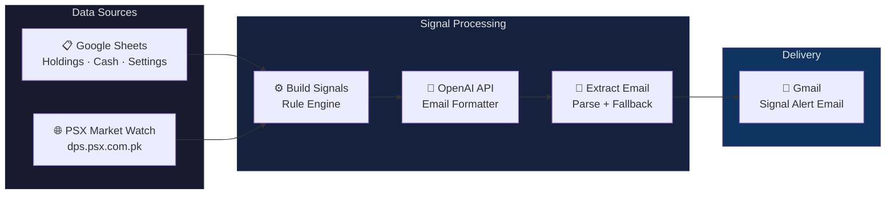
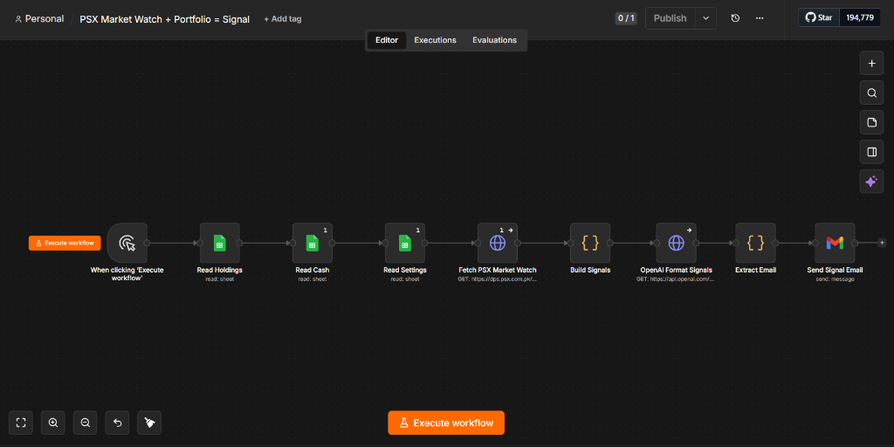
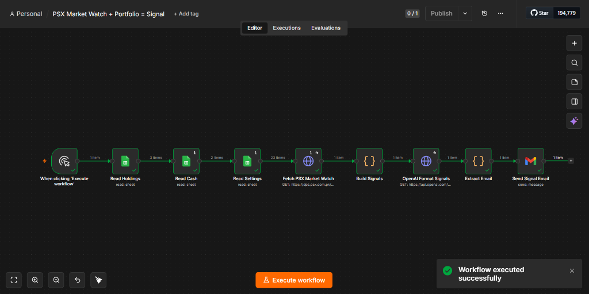
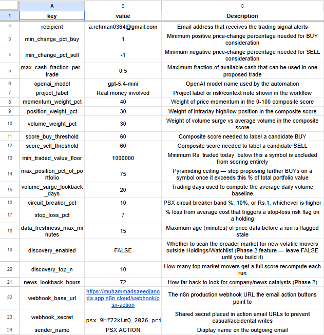
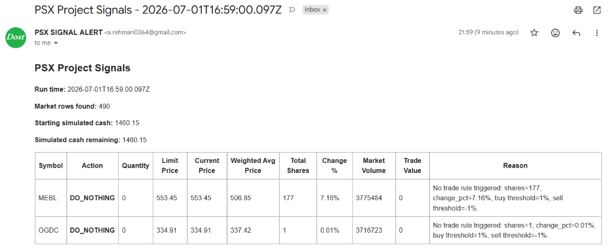

<div align="center">

# 📈 PSX Market Watch Signals

**Automated trading signal pipeline for Pakistan Stock Exchange (PSX)**

*Live market data · Portfolio analysis · Rule-based signals · AI-formatted email alerts*

[](https://n8n.io/)
[](https://openai.com/)
[](https://sheets.google.com/)
[](https://gmail.com/)
[](LICENSE)

---

[Features](#-features) · [Architecture](#-architecture) · [Screenshots](#-screenshots) · [Quick Start](#-quick-start) · [Configuration](#%EF%B8%8F-configuration) · [How It Works](#-how-it-works) · [Roadmap](#-roadmap) · [License](#-license)

</div>

---

## 🚀 Overview

**PSX Market Watch Signals** is a production-grade n8n automation workflow that scrapes real-time market data from the [Pakistan Stock Exchange (PSX)](https://dps.psx.com.pk/market-watch), cross-references it with your personal portfolio holdings, applies configurable risk-aware trading rules, and delivers AI-formatted signal alerts directly to your inbox.

> **⚠️ Real Money System** — This system is designed for and actively used with a real-money portfolio. Every signal includes a mandatory human review step. No trades are executed automatically.

### What makes this different?

- **Not a toy project** — Handles 490+ live PSX symbols per run with real portfolio data
- **Defense-in-depth** — Multiple safety layers: lot sizing, cash fraction limits, circuit breakers, and mandatory human review
- **AI-enhanced, not AI-dependent** — Rule engine generates signals first; OpenAI only formats the email report (with a fallback template if the API fails)
- **Zero dependencies** — Runs entirely on n8n + Google Sheets; no database, no backend server, no npm packages

---

## ✨ Features

| Category | Feature | Details |
|:---------|:--------|:--------|
| 📡 **Data Ingestion** | Live PSX scraping | Parses 490+ symbols from the official DPS market-watch page with dual-mode HTML/text parser |
| 📊 **Portfolio Tracking** | Google Sheets integration | Reads holdings, cash balance, watchlist, and settings from a single spreadsheet |
| 🧠 **Signal Engine** | Rule-based signal generation | Configurable buy/sell thresholds, lot-aware position sizing, cash fraction limits |
| 🤖 **AI Formatting** | OpenAI-powered email reports | Structured JSON schema output via OpenAI Responses API with strict mode |
| 🛡️ **Risk Controls** | Multi-layer safety | Circuit breaker detection, stop-loss tracking, max position caps, lot rounding |
| 📧 **Email Delivery** | Gmail integration | Professional HTML signal reports delivered as "PSX SIGNAL ALERT" |
| 🔄 **Fault Tolerance** | Graceful degradation | Fallback email template, safe row parsing, error-resilient market data extraction |

---

## 🏗 Architecture



### Pipeline Flow

```
Manual Trigger
  → Read Holdings (Google Sheets — Holding tab)
    → Read Cash (Google Sheets — Cash tab)
      → Read Settings (Google Sheets — Settings tab)
        → Fetch PSX Market Watch (HTTP GET — dps.psx.com.pk)
          → Build Signals (JavaScript — rule engine)
            → OpenAI Format Signals (API — structured JSON output)
              → Extract Email (JavaScript — parse + fallback)
                → Send Signal Email (Gmail)
```

---

## 📸 Screenshots

<details>
<summary><b>🔧 Workflow Editor</b> — n8n canvas showing the full 8-node pipeline</summary>



</details>

<details>
<summary><b>✅ Successful Execution</b> — All nodes executed with data flowing through</summary>



</details>

<details>
<summary><b>⚙️ Settings Sheet</b> — Google Sheets configuration with 20+ tunable parameters</summary>



</details>

<details>
<summary><b>📧 Signal Email</b> — AI-formatted email alert delivered to inbox</summary>



</details>

---

## 🚀 Quick Start

### Prerequisites

| Requirement | Purpose |
|:-----------|:--------|
| [n8n](https://n8n.io/) (self-hosted or cloud) | Workflow automation platform |
| Google Cloud project with Sheets + Gmail OAuth2 | Portfolio data + email delivery |
| OpenAI API key | AI-powered email formatting |
| Google Sheets spreadsheet | Portfolio data store (see [template](#google-sheets-template)) |

### Installation

1. **Import the workflow** into your n8n instance:
   ```
   n8n Editor → Import from File → workflow/psx-market-watch-signals.json
   ```

2. **Set up credentials** in n8n:
   - `Google Sheets OAuth2 API` — for reading portfolio data
   - `HTTP Header Auth` — for OpenAI API key (header: `Authorization: Bearer sk-...`)
   - `Gmail OAuth2 API` — for sending email alerts

3. **Create the Google Sheets spreadsheet** with 4 tabs (see [Configuration Guide](docs/CONFIGURATION.md)):
   - **Holding** — your stock positions
   - **Cash** — available trading capital
   - **Settings** — all configurable parameters
   - **Watchlist** *(optional)* — symbols to monitor for buying opportunities

4. **Update the workflow** nodes with your Google Sheets document ID.

5. **Test** by clicking "Execute workflow" in the n8n editor.

> 📘 For detailed setup instructions, see **[docs/SETUP.md](docs/SETUP.md)**

---

## ⚙️ Configuration

All trading parameters are controlled via the **Settings** tab in Google Sheets — no code changes needed.

### Core Trading Rules

| Key | Default | Description |
|:----|:--------|:-----------|
| `min_change_pct_buy` | `1` | Minimum positive % change to trigger a BUY candidate |
| `min_change_pct_sell` | `-1` | Minimum negative % change to trigger a SELL candidate |
| `max_cash_fraction_per_trade` | `0.5` | Maximum fraction of available cash per single trade |
| `default_max_trade_value` | `50000` | Maximum trade value (PKR) per signal |
| `default_lot_size` | `1` | Default lot size for position rounding |

### Risk Controls

| Key | Default | Description |
|:----|:--------|:-----------|
| `circuit_breaker_pct` | `10` | PSX circuit breaker band (%, or Rs.1 whichever is higher) |
| `stop_loss_pct` | `7` | % loss from avg cost that triggers a stop-loss risk flag |
| `max_position_pct_of_portfolio` | `75` | Pyramiding ceiling — stops BUYs once position exceeds this % of total value |
| `data_freshness_max_minutes` | `15` | Maximum age of price data before a run is flagged stale |
| `min_traded_value_floor` | `1000000` | Minimum Rs. traded today to include a symbol in scoring |

### Composite Scoring

| Key | Default | Description |
|:----|:--------|:-----------|
| `momentum_weight_pct` | `40` | Weight of price momentum in the 0–100 composite score |
| `position_weight_pct` | `30` | Weight of intraday high/low position in the composite score |
| `volume_weight_pct` | `30` | Weight of volume surge vs. average daily volume |
| `score_buy_threshold` | `60` | Composite score needed to label a candidate BUY |
| `score_sell_threshold` | `60` | Composite score needed to label a candidate SELL |
| `volume_surge_lookback_days` | `20` | Trading days used to compute average daily volume baseline |

### System

| Key | Example | Description |
|:----|:--------|:-----------|
| `recipient` | `you@gmail.com` | Email address for signal alerts |
| `openai_model` | `gpt-4o-mini` | OpenAI model used for email formatting |
| `sender_name` | `PSX ACTION` | Display name on outgoing emails |
| `project_label` | `Real money involved` | Context label shown in workflow |

> 📘 For the complete configuration reference, see **[docs/CONFIGURATION.md](docs/CONFIGURATION.md)**

---

## 🔍 How It Works

### 1. Data Collection

The workflow reads from **four data sources** in sequence:

- **Holdings tab** — Each row is a lot: `symbol`, `shares`, `avg_price`, `lot_size`, `max_trade_value`
- **Cash tab** — Rows with an `amount` column, summed to compute available capital
- **Settings tab** — Key-value pairs controlling all trading rules (see table above)
- **PSX Market Watch** — HTTP GET to `dps.psx.com.pk/market-watch`, parsed from raw HTML

### 2. Market Data Parsing

The parser uses a **dual-mode extraction** strategy:

1. **Primary (HTML table mode)** — Matches `<tr>` elements, extracts cells, maps the last 8 numeric columns to `ldcp`, `open`, `high`, `low`, `current`, `change`, `change_pct`, `volume`
2. **Fallback (text mode)** — If no table rows are found, cleans the HTML to plain text and applies regex-based line splitting with numeric tail extraction

This makes the parser resilient to minor changes in the PSX website structure.

### 3. Signal Generation

For each symbol in holdings + watchlist:

```
IF holding exists AND change_pct ≤ sell_threshold:
    → SELL signal (50% of position, rounded to lot size)
    → Limit price = current × 0.995 (slight discount)

ELSE IF no holding AND change_pct ≥ buy_threshold AND cash available:
    → BUY signal (max_trade_value / current_price, rounded to lot size)
    → Limit price = current × 1.005 (slight premium)

ELSE:
    → DO_NOTHING (with detailed reason)
```

Cash is tracked simulation-style across signals to prevent over-commitment.

### 4. AI Email Formatting

The signal data is sent to OpenAI's Responses API with:
- **Strict JSON schema** — Enforces `email_subject`, `email_html`, `signal_count`, and typed `rows[]`
- **Defensive instructions** — AI cannot invent trades, increase quantities, or make prices more aggressive
- **Fallback template** — If the API call fails or returns invalid JSON, a built-in HTML template generates the email

### 5. Email Delivery

The formatted email is sent via Gmail OAuth2 with the sender name "PSX SIGNAL ALERT". Each email includes:
- Run timestamp and market data freshness info
- Signal table with action, quantity, limit price, current price, change %, volume, and reason
- **Mandatory warning**: *"Real money involved — review manually before placing any order"*

---

## 📋 Google Sheets Template

Create a Google Spreadsheet with these tabs:

### Holding Tab
| symbol | lot_id | shares | avg_price | max_trade_value | lot_size |
|--------|--------|--------|-----------|-----------------|----------|
| MEBL | lot-1 | 177 | 506.85 | 100000 | 1 |
| OGDC | lot-1 | 1 | 337.42 | 100000 | 1 |

### Cash Tab
| amount |
|--------|
| 1460.15 |

### Settings Tab
See the [Configuration](#%EF%B8%8F-configuration) section above for all available keys.

### Watchlist Tab *(optional)*
| symbol | max_trade_value | lot_size |
|--------|-----------------|----------|
| ENGRO | 50000 | 1 |
| HBL | 50000 | 1 |

---

## 🗺 Roadmap

- [x] Core signal engine with configurable thresholds
- [x] OpenAI-powered email formatting with fallback
- [x] Multi-lot portfolio tracking with weighted average pricing
- [x] Composite scoring system (momentum + position + volume weights)
- [x] Risk controls: circuit breaker, stop-loss, position ceiling
- [ ] **Phase 2**: Discovery mode — scan broader market for new volatile movers outside holdings/watchlist
- [ ] **Phase 2**: News catalyst integration — look back N hours for company news as an additional signal
- [ ] Webhook action buttons — one-click approve/reject signals from email
- [ ] Historical signal logging — track signal accuracy over time
- [ ] Scheduled execution — run automatically during PSX trading hours

---

## 🛠 Tech Stack

| Layer | Technology |
|:------|:-----------|
| **Orchestration** | [n8n](https://n8n.io/) — workflow automation platform |
| **Data Store** | [Google Sheets](https://sheets.google.com/) — portfolio, cash, settings, watchlist |
| **Market Data** | [DPS PSX Market Watch](https://dps.psx.com.pk/market-watch) — official Pakistan Stock Exchange feed |
| **AI** | [OpenAI Responses API](https://platform.openai.com/docs/api-reference) — structured email formatting |
| **Email** | [Gmail API](https://developers.google.com/gmail/api) — OAuth2-authenticated email delivery |
| **Language** | JavaScript (ES2020+) — signal engine + email extraction logic |

---

## 📁 Repository Structure

```
psx-market-watch-signals/
├── README.md                  # This file
├── LICENSE                    # Apache 2.0
├── .gitignore
├── workflow/
│   └── psx-market-watch-signals.json   # Sanitized n8n workflow (import-ready)
├── docs/
│   ├── SETUP.md               # Detailed setup guide
│   └── CONFIGURATION.md       # Complete settings reference
└── assets/
    ├── workflow-editor.png    # n8n editor screenshot
    ├── workflow-executed.png  # Successful execution screenshot
    ├── settings-sheet.png     # Settings tab screenshot
    └── signal-email.png       # Email output screenshot
```

---

## ⚠️ Disclaimer

This project is a **decision-support tool**, not an automated trading system. It generates *candidate* signals for human review. No trades are executed automatically.

- **Do your own research** before acting on any signal
- **Past performance** does not guarantee future results
- The author is **not liable** for any financial losses incurred from using this system
- This project is **not affiliated** with the Pakistan Stock Exchange (PSX) or any brokerage

---

## 📄 License

This project is licensed under the **Apache License 2.0** — see the [LICENSE](LICENSE) file for details.

---

<div align="center">

**Built with ❤️ for the PSX trading community**

[⬆ Back to Top](#-psx-market-watch-signals)

</div>
